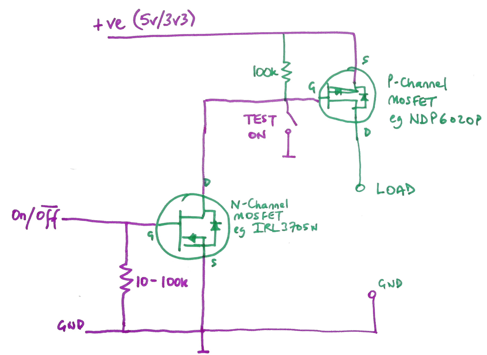

# LTC2954 On Off Emulator
How to request a graceful shutdown of your microcontroller project without using an LTC2954.

## See https:.//youtube.com/ralphbacon Video #172
Direct link to video: https://youtu.be/6OH_ZiD2xoI

The Linear Technology **LTC2954** device allows a single push button on *and* off of your microcontroller (via a P-channel MOSFET). Additionally it can request an emergency shutdown via a user-configurable delay by pressing and holding the aforementioned button for several seconds.

Here's how to emulate the first two features using our previously used (video #123) Auto Shutoff dual MOSFET circuitry with just a couple of extra components.

Compare the following two circuits; the one of the left is the original circuit; the other is the modified circuit to allow a graceful shutdown request to be be sent to the µController.

The two additional diodes are just IN4148 small signal diodes. Nothing special!

The shutdown request is serviced by the microcontroller on an interrupt pin. Full details in the video.

### LINKS

Linear Technologies **LTC2954** from RS Components UK Warehouse, about £3 / $4:  
https://uk.rs-online.com/web/c/semiconductors/power-management-ics/voltage-supervisors/?searchTerm=LTC2954  

**LTC2954** From AliExpress, $10 for 5 pieces free shipping:  
http://s.click.aliexpress.com/e/nLNYrk4s  

DUAL MOSFET CJMCU-4599 Si4599 N and P Channel MOSFET Expansion Board $1.89 each or $4.08 for 3 pieces:  
**Single:**  https://www.banggood.com/CJMCU-4599-Si4599-N-and-P-Channel-40V-D-S-MOSFET-Expansion-Board-Module-p-1350610.html?p=FQ040729393382015118&utm_campaign=25129675&utm_content=3897  
**3 Pieces:**  https://www.banggood.com/3pcs-CJMCU-4599-Si4599-N-and-P-Channel-40V-D-S-MOSFET-Expansion-Board-Module-p-1363266.html?p=FQ040729393382015118&utm_campaign=25129675&utm_content=3897  

**Datasheet for LTC2954**:  
https://www.analog.com/media/en/technical-documentation/data-sheets/2954fb.pdf  

**Datasheet for Si4599** dual MOSFET:  
https://www.vishay.com/docs/68971/si4599dy.pdf  

Interactive **cheat sheet** for calculating potential (resistor) divider values:  
http://www.ohmslawcalculator.com/voltage-divider-calculator

### List of all my videos
(Special thanks to Michael Kurt Vogel for compiling this)  
http://bit.ly/YouTubeVideoList-RalphBacon

### My blog article on what happened to my eye (again):  
https://ralphbacon.blog/?p=340

### Popular Links  
YIHUA 938D Portable Hot **Tweezers Mini** Soldering Station 110V/220V    
https://bit.ly/2M8R0bj  

DANIU Heavy Duty Soldering Solder Iron **Tip Cleaner** Steel Wire $3.33 from China, higher price local warehouse  
http://bit.ly/SolderingIronCLeaner

SMD Components Solder **Practice Module Kit** - all components incl QFP chips  
http://bit.ly/SMDPracticeBoard

If you like this video please give it a thumbs up, share it and if you're not already subscribed please consider doing so and joining me on my Arduinite journey  

My channel and blog are here:  
\------------------------------------------------------------------  
https://www.youtube.com/RalphBacon  
https://ralphbacon.blog  
\------------------------------------------------------------------
